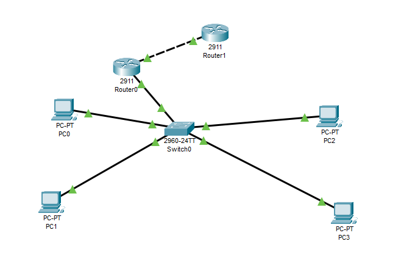

<!-- ========================================================= -->
<!--                    HERO / HEADER                          -->
<!-- ========================================================= -->

# 👋 Hello, I'm **Sonia LOPEZ**

### `Cybersecurity Studient` · `3rd Year Bachelor at NEXA Digital School`

  I build digital experiences that are
  <strong>useful, beautiful and technically solid.</strong>

 

 

<!-- ========================================================= -->
<!--                       ABOUT ME                            -->
<!-- ========================================================= -->

## 👩‍🎓 ABOUT ME

<table>
<tr>
<td width="55%">

### Who am I?

I'm **Sonia LOPEZ**, a third-year Bachelor's student in Cybersecurity at NEXA Digital School.

Passionate about cybersecurity, I enjoy studyng threats, understanding how they work, and finding effective ways to counter them.

I learn, experiment, and constantly strive to improve my work methods to develop my skills and take on new challenger.

 

> *"Knowledge is an asset, experience is a necessity."*

</td>

<td width="45%">

### ⚡ Quick facts

- 🔐 Cybersecurity
- 🧠 Skills & Technologies
- 🧪 Labs & CTF
- 🚀 Projects
- 📚 Learning journey
- 🎯 Goals
- 📫 Contact
- 🌍 Based in **France**

</td>
</tr>
</table>

 

<!-- ========================================================= -->
<!--                        STATS                              -->
<!-- ========================================================= -->

## #️⃣ A FEW NUMBERS

<table>
<tr>

<td align="center" width="25%">

### 🚀

**PROJECTS**

`20`

</td>

<td align="center" width="25%">

### 💻

**TECHNOLOGIES**

`30`

</td>

<td align="center" width="25%">

### ⭐

**GITHUB REPOS**

`1`

</td>

<td align="center" width="25%">

### 🧠

**YEARS LEARNING**

`3`

</td>

</tr>
</table>

 

<!-- ========================================================= -->
<!--                     TECHNOLOGIES                         -->
<!-- ========================================================= -->

## 🧩 TECHNOLOGIES I WORK WITH

 

### Networks & Cybersecurity

  
  
  
  
  
  
  
  
  

  

### Systems

  
  
  
  
  
  
  

  

### Virtualization & Infrastructure

  
  
  

  

### Development

  
  
  
  
  

  

### Development & Administration Tools

  
  
  
  
  

 

<!-- ========================================================= -->
<!--                    FEATURED PROJECTS                      -->
<!-- ========================================================= -->

## 🏆 FEATURED PROJECTS

### Some things I've built

 

<table>
<tr>

<td width="50%">

## Secure VLAN and VPN network

### Description

This project involves designing and configuring a network infrastructure in Cisco Packet Tracer that incorporates VLAN segmentation, inter-VLAN routing, and communication filtering using an ACL. A second router is then added to implement an IPsec VPN and secure data exchange between two networks.

**Tech stack**

`Cisco Packet Tracer` `Cisco Routers` `Cisco Switch` `802.1Q VLAN` `Inter-VLAN routing (Router-on-a-Stick)`
`ACL (Access Control List)` `IPsec VPN` `ISAKMP / IKE` `ESP (AES / SHA)` `IP/ICMP protocols`

 

<a href="#">
  🔗 View Project
</a>

&nbsp;&nbsp;

</td>

<td width="50%">

## 🌌 Project Two

### Description

A short description of your second project.

You can explain the problem it solves and the technologies you used.

**Tech stack**

`Python` `FastAPI` `PostgreSQL`

 

<a href="#">
  🔗 View Project
</a>

&nbsp;&nbsp;

</td>

</tr>

<tr>

<td width="50%">

## 💎 Project Three

### Description

Another project that you want to highlight.

**Tech stack**

`Next.js` `Tailwind` `Supabase`

 

<a href="#">
  🔗 View Project
</a>

&nbsp;&nbsp;

</td>

<td width="50%">

## 🧪 Project Four

### Description

This space is ready for a future project.

You can replace this card whenever you want.

**Tech stack**

`Technology` `Technology` `Technology`

 

<a href="#">
  🔗 View Project
</a>

&nbsp;&nbsp;

</td>

</tr>
</table>

 

<!-- ========================================================= -->
<!--                       CURRENTLY                           -->
<!-- ========================================================= -->

## ✦ CURRENTLY

<table>
<tr>

<td width="33%" align="center">

### 🔭 Working on

**TON PROJET ACTUEL**

</td>

<td width="33%" align="center">

### 🌱 Learning

**UNE TECHNOLOGIE**

</td>

<td width="33%" align="center">

### 💡 Exploring

**UN DOMAINE**

</td>

</tr>
</table>

 

<!-- ========================================================= -->
<!--                        JOURNEY                            -->
<!-- ========================================================= -->

## 🧭 MY JOURNEY

 

<table>
<tr>
<td align="center" width="20%">

### 2021

🎓

**Specializes technological baccalaureate in Human Resources**

</td>

<td align="center">→</td>

<td align="center" width="20%">

### 2021 - 2023

📦🚚

**Delivery Worker**

</td>

<td align="center">→</td>

<td align="center" width="20%">

### 2023 - 2024

👩‍🏭📦

**Temporary Worker**

</td>

<td align="center">→</td>

<td align="center" width="20%">

### 2024 - 2027

👩‍🎓🔐💻

**Cyber Bachelor**

</td>

<td align="center">→</td>

<td align="center" width="20%">

### 2027 - 20?

🕵‍♀️🔐🛡️

**Cyber Administrator**

</td>

<td align="center">→</td>

<td align="center" width="20%">

### 20? - 20?

👩‍🎓🔐💻

**Cyber Master**

</td>

<td align="center">→</td>

<td align="center" width="20%">

### 2035

🔥🕵‍♀️🔐🛡️

**Cybersecurity Analyst**

</td>

</tr>
</table>

 

<!-- ========================================================= -->
<!--                      CONTACT                              -->
<!-- ========================================================= -->

# 🌱 LET'S BUILD SOMETHING

### Have an idea, a project or simply want to talk?

 

&nbsp;&nbsp;·&nbsp;&nbsp;

&nbsp;&nbsp;·&nbsp;&nbsp;

  

---

Designed & built with ❤️ by <strong>Sonia LOPEZ</strong>

